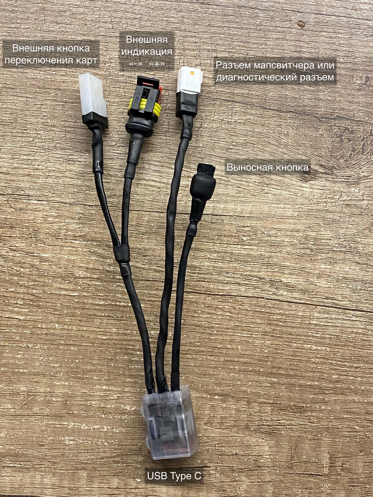

# Руководство пользователя

## Оглавление
- [Установка на мотоцикл](#установка-на-мотоцикл)
- [Базовая настройка](#базовая-настройка)
- [Базовые сценарии использования](#базовые-сценарии-использования)
- [Органы управления](#органы-управления)
- [Режимы работы](#режимы-работы)
- [Обслуживание устройства](#обслуживание-устройства)

## Установка на мотоцикл



1. Присоединить устройство к разъему мапсвитчера или в диагностический разъем за фарой мотоцикла (зависит от ревизии)
2. Опционально присоединить кнопку переключения карт
3. Опционально присоединить внешний индикатор (светодиод)
4. Закрепить блок стяжками в удобном месте

## Базовая настройка

1. К заглушенному мотоциклу присоединить донгл, входящий в комплект к мотоциклу (обязательный шаг)
2. Переключить устройство в диагностический режим (см. ниже) и подсоединиться с телефона
3. Убедиться в работоспособности: при повороте ручки газа в интерфейсе должна меняться TPS (в вольтах).
4. Нажать на иконку "шестеренки"
5. Выбрать нужный режим кнопки мапсвитчера
6. Сохранить настройки и перезагрузить устройство

> **Важно**: Все настройки (кроме внешнего вида интерфейса) применяются после перезагрузки устройства.

## Базовые сценарии использования

### Переключение карт
Осуществляется одним из способов:
- Кнопкой мапсвитчера
- Из диагностического режима

### Стирание ошибок
Осуществляется одним из способов:
- Из диагностического режима
- Длинным нажатием на выносную кнопку

> **Важно**: Большинство ошибок стираются на заглушенном мотоцикле и после стирания держатся еще несколько секунд. Для стирания некоторых ошибок необходимо дать мотоциклу "заснуть" после стирания и снова проснуться.

## Органы управления/разъемы

### Индикатор

Устройство оборудовано:
- Внутренним индикатором (если корпус прозрачный)
- Опциональным разъемом под внешний индикатор (светодиод 3.3В). Полярность подключения важна (желтый провод - "+", черный - "–")

#### Режимы индикации:
- В режиме мапсвитчера: 
    - Отображает текущую карту
    - При наличии ошибки ECU: моргает "3 длинных, 3 коротких"
- В режиме диагностики
    - Медленно моргает
- При операциях (перезагрузка, стирание ошибок, переключение карт): быстро моргает

> **Примечание**: Индикацию можно инвертировать в настройках.

### Интерфейс подключения кнопки мапсвитчера

В зависимости от версии могут быть просто провода (синий и черный), так и обжатый разъем. Полярность подключения не важна. Поддерживаются как переключатели с фиксацией, так и без. 

Функции:
1. Переключает карты согласно настройкам
   - По умолчанию: замкнуто - "белая" карта, разомкнуто - "зеленая" карта
2. Тройное быстрое замыкание-размыкание включает диагностический режим

### Выносная кнопка (опционально)

Функции:
1. Однократное нажатие: перезагрузка (режим настраивается)
2. Двукратное нажатие: вход в диагностический режим
3. Длинное нажатие: стирание ошибок ECU (с индикацией)

## Режимы работы

### Режим переключения карт

Это режим по умолчанию после загрузки (если не переопределено настройками).

#### Поддерживаемые режимы кнопки:
1. С фиксацией, замкнутая – зеленая
   - Замкнут контакт → зеленая карта
   - Разомкнут контакт → белая карта
2. С фиксацией, разомкнутая - зеленая
   - Замкнут контакт → белая карта
   - Разомкнут контакт → зеленая карта
3. Без фиксации
   - Однократное нажатие переключает карту
4. Без фиксации (с задержкой)
   - Поведение аналогично родной кнопке
   - Требуется удержание для переключения

#### Индикация:
- При переключении: быстрое мигание индикатора
- Зеленая карта: индикатор горит постоянно
- Белая карта: индикатор выключен
- Ошибка ECU: три медленных мигания, три быстрых мигания, возврат в режим индикации текущей карты

> **Примечание**: Поведение индикатора можно инвертировать в настройках.

### Диагностический режим

⚠️ **Внимание**: В диагностическом режиме устройство работает как Wi-Fi точка доступа. При этом создается постоянная нагрузка на CAN-шину. Постоянная эксплуатация (езда) в этом режиме не рекомендуется. При необходимости "разбудить" незаведенный мотоцикл требуется подключить комплектный донгл для прокачки масла.

#### Способы включения:
1. Двойное нажатие на выносную кнопку
2. Тройное нажатие на кнопку переключения карт
3. Автоматически при загрузке (если настроено)

#### Выход из диагностического реджима
1. Одиночное нажатие на выносную кнопку (при наличии)
2. Отключение питания
3. При отсутствии активных Wi-Fi подключений в течении 1 минуты, произойдет автоматический выход из режима диагностики 

#### Подключение к интерфейсу:
1. Подключиться к WiFi сети "TBI DIAG"
2. Открыть в браузере:
   - `http://tbi.top` (при включенном DNS в настройках)
   - или `http://192.168.11.1`

#### Основной экран

Верхняя строка отображает VIN-номер подключенного мотоцикла, кнопку настроек, кнопку перезагрузки и статус подключения в виде точки. Красный - веб-интерфейс не видит устройство. Желтый - устройство обнаружено, но оно не видит мотоцикл. Зеленый - все в порядке.

Основной экран содержит параметры различных датчиков: температуры антифриза, внешнего воздуха, напряжения батареи, ДПДЗ, обороты двигателяЮ показатели MAP-сенсоров и т.д. Некоторые из параметров можно отобразить в виде графиков, нажав на них. У таких параметров есть иконка графика.

#### Настройки
Открываются при нажатии в веб-интерфейсе на иконке шестеренок.

- **Внешний вид**. Задает внешний вид веб-интерфейса
- **Режим по умолчанию**. В каком режиме устройство будет включаться. Опция "диагностика" предназначена, если устройство планируется подключать к мотоциклу только эпизодически для проверки параметров и сброса ошибок. При включенной этой настройке невозможно переключиться в режим переключения карт с кнопки.
- **Кнопка переключения карт**. Задает режим работы внешней кнопки переключения карт. 
    - **С фиксацией, замкнутая – зеленая**. Если контакт кнопки замкнут, то будет включена "зеленая" карта. Если контакт разомкнут - "белая". Подходит при подключении, например, кнопки переключения поворотов в качестве мапсвитчера.
    - **С фиксацией, замкнутая – белая**. Если контакт кнопки замкнут, то будет включена "белая" карта. Если контакт разомкнут - "зеленая". По своей сути обратное поведение к первой опции.
    - **Без фиксации**. Карта будет циклически переключаться при каждом нажатии на кнопку.
    - **Без фиксации (с задержкой)**. Аналогично предыдущей опции, но требуется удерживать кнопку в течении секунды. Похоже на поведение родной кнопки карт.
- **Инвертировать индикатор**. Позволяет при "зеленой" карте гасить внешнюю лампу, а при "белой" ее включать. Важно: индикатор на самом блоке (синего цвета) инвертирован относительно внешнего. Эта особенность на уровне схемотехники.
- **Включить DNS**. Отвечать в браузере на любые адреса (например, `http://ktm.top` и т.д.), или открывать доступ только по ip `192.168.11.1`. Вторая опция позволяет настроить использование одновременно интерфейса диагностики и внешнего интернета.
- **Версия прошивки**. Отображает версию прошивки и ревизию "железа". Важно при обращении в поддержку
- **Сохранить**. Сохраняет настройки. Все настройки кроме внещнего вида применяются после перезагрузки. Перезагрузка осуществляется либо выносной кнопкой (при наличии), либо из веб-интерфейса (иконка выключения рядом с кнопкой шестеренок), либо отключением питания.
**Сброс настроек**. Настройки сбрасываются к заводским. Применяется так же после перезагрузки.


> **Важно**: Все настройки (кроме внешнего вида интерфейса) применяются после перезагрузки устройства.

#### Выход из режима:
- Перезагрузка устройства (если не настроена постоянная загрузка в диагностический режим)

## Обслуживание устройства

### Перезагрузка

Способы перезагрузки:
1. Однократное нажатие выносной кнопки
2. Отключение/включение питания
3. Через веб-интерфейс в режиме диагностики

### Прошивка устройства

**Внимание**: После прошивки все настройки сбрасываются к значениям по умолчанию.

#### Автоматическая прошивка:
1. Подсоединить кабелем USB-C модуль к компьютеру
1. Разархивировать файлы в папку
2. Запустить `flash.bat`

Если модуль не находится, попробовать перевернуть разъем и перезагрузить его. 

#### Ручная прошивка:

Для Windows:
```bash
esptool.exe write_flash 0x0 firmware.bin
```

Для Mac/Linux:
```bash

esptool.py write_flash 0x0 firmware.bin
```

> **Внимание**: Для восстановления настроек после прошивки войдите в диагностический режим и настройте параметры заново.

### Поддержка

* Telegram: @psamoilov