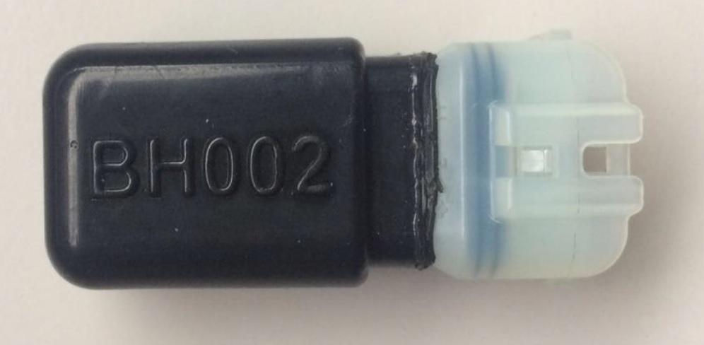
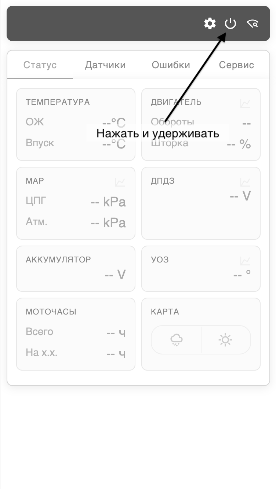
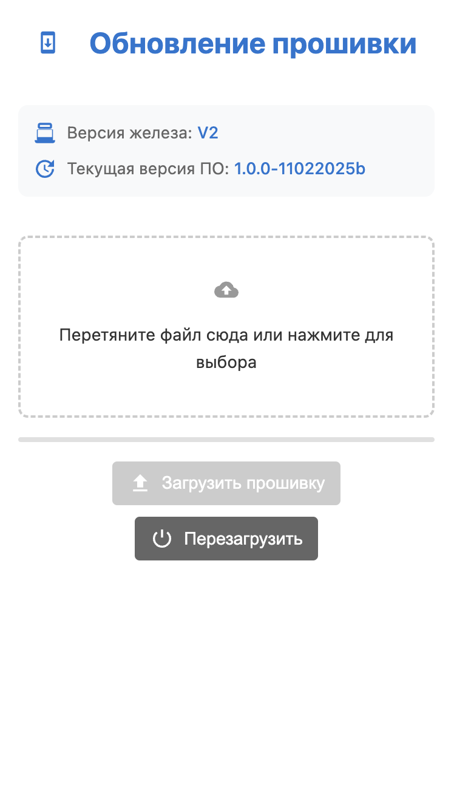

# Прошивка устройства

Устройство поддерживает обновляемые прошивки. Обновления прошивок добавляют новый функционал и чинят известные ошибки в работе бокса (но это не точно).


## Как обновить прошивку
Самый простой и рекомендуемый путь – обновление прошивки "по воздуху", без проводов. При этом способе не собьются пользовательские настройки, сервисные интервалы, процесс не требует проводов и запуска команд в командной строке. Порядок действий описан ниже.

### Подключаем к источнику питания
В базовом варианте это мотоцикл с присоединенным донглом BH002, который идет в комплекте с мотоциклом (чтобы по время прошивки вдруг не пропало питание). 
{: width="80%"}

В качестве альтернативы, при доступности USB-разъема можно присоединить любой источник питания USB: ноутбук, зарядку, powerbank итд.
При поданном питании на блоке будет гореть красный светодиод (если корпус прозрачный).

### Переводим в режим обновления 
#### Внешней кнопкой
Нужно быстро три раза нажать на выносную кнопку. Если все получилось, синяя лампа на блоке начнет быстро моргать – это значит, что теперь можно переходить к следующему этапу

#### Из диагностического режима
Такой способ пригодится для "диагностических" версий бокса, у которых нет внешней кнопки (но работает и для полных версий). В диагностическом режиме нужно нажать и удерживать кнопку перезагрузки.

{: width="50%"}

### Загрузка прошивки 
Подключаемся к боксу по WiFi как обычно, переходим на адрес http://192.168.11.1 и попадаем в интерфейс загрузки. Здесь отображается версия железа бокса. 
> **Внимание**: Убедитесь, что файл, которым вы собираетесь обновляться от той же версии железа! В случае заливки другой версии, вы рискуете "попасть" на полную прошивку – не будут работать кнопки и внешние переключатели. Это не фатально, но неприятно. Файл обновления называется firmware_update.VX.bin, где X - версия железа.

{: width="50%" .center}

Далее все просто, нажимаем "Загрузить прошивку", дожидаемся результата, бокс перезагружается в обычный режим. 

> **Внимание**: если при обновлении возникает ошибка (процесс не доходит до конца, не появляется сообщение об успешном окончании) попробуйте немного отойти от бокса (чтобы ухудшился WiFi сигнал). Из-за ошибок в ранней версии обновление по воздуху было не всегда стабильным и это может решить проблему.

## Обновление по проводу
Этот способ требует подключение блока к компьютеру по USB. Пригодится в следующих случаях:

- Мотоцикл не доступен, а прошивку залить хочется
- Нужно залить полную прошивку для восстановления (например, после обновления по воздух прошивкой от блока другой "железной" версии)

> Разъем USB может быть залит компаундом – прозрачным герметезирующим составом. Это сделано из соображений влагостойкости блока. Если нужен доступ к USB, то нужно взять что-то тонкое (иголка от шприца подойдет) и аккуратно выковырять компаунд из разъема, не повредив его.


### Отличия полной и частичной прошивок

> В данном случае "полная" не означает "хорошая". Обычно ее нужно залить, когда кто-то накосячил – либо потребитель, либо производитель.

***Полная прошивка***
Включает в себя полный образ флеш-памяти устройства. Это означает, что при ее записи перезапишется все: и настройки, и все остальное. Бокс вернется к "заводскому" состоянию. Имя файла пролной прошивки ***firmware_full.vX.bin***, где X - версия "железа".

***Частичная прошивка***
Включает в себя только программу. Это означает, что при ее записи перезапишется только программа, а настройки и прочее сохранятся. Имя файла пролной прошивки ***firmware_update.vX.bin***, где X - версия "железа". Если нет проблем, с устройством, лить нужно именно ее.


### Предварительные ритуалы

- Скачать набор утилит для прошивке по [ссылке](firmware/firmware-tools.zip) и разархивировать в какую-то папку.
- Положить файл прошивки (полный или частичный) в ту же папку

### Автоматическая прошивка
- Запустить `flash.bat` для Windows или `flash.sh` для Mac
- Ответить на вопросы о ревизии блока и типе прошивки (полная или только программа)

### Ручная прошивка

Нужна, если с автоматическим что-то пошло не так. Нужно запустить командную строку (терминал) в папке, где лежат утилиты прошивки и сам файл прошивки.

#### Полная прошивка

Для Windows:
```bash
esptool.exe write_flash 0x0 firmware_full.vX.bin
```

> Где X - номер ревизии

Для Mac/Linux:
```bash

esptool.py write_flash 0x0 firmware_full.vX.bin
```

#### Частичная прошивка

Для Windows:
```bash
esptool.exe write_flash 0x10000 firmware_update.vX.bin
```

> Где X - номер ревизии

Для Mac/Linux:
```bash

esptool.py write_flash 0x10000 firmware_update.vX.bin
```